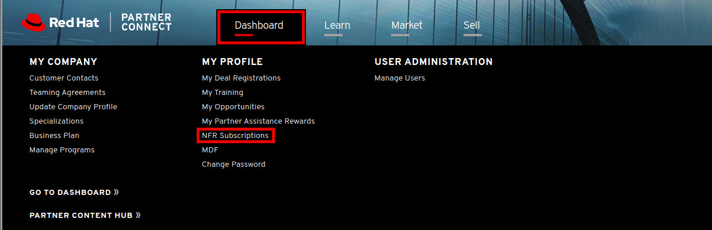
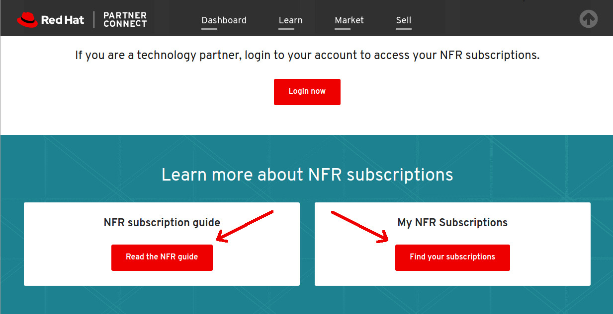

= Red Hat Not For Resale (NFR) Subscriptions

* As a partner you have access to all of Red Hat software for development purposes at no cost to you.  This is what we refer to as *"Not For Resale (NFR) Subscriptions"*.  In order to access and manage all of your NFR subscription needs, login to the link:https://partnercenter.redhat.com/Dashboard_page[Red Hat Partner Connect Dashboard^].  

[.lead]
Next click on the *Dashboard* tab and then click *NFR Subscriptions*.

[.lead]
Scroll down to the *How to request an NFR subscription* section for a general overview of the process.

For details on the NFR subscription request process, reference the following document: link:https://www.redhat.com/files/other/partners/Howtoguide-createanewNFR.pdf[How to request a new NFR subsctiption]

[.lead]
Also further down on this page, links are available for the *NFR subscription guide*, as well as a link to *My NFR Subscriptions*, the page for managing current NFR subscriptions, as well as viewing all past NFR subscriptions, under the partner organization.

* After you have been granted access to a particular NFR subscription, please follow these instructions to access and leverage the subscription.  The example below is for Red Hat Openstack, however it applies to any NFR software provided by Red Hat.

While logged in to a server where RHEL has been installed, as the root user (or as a non-root user with sudo priveleges insert sudo at the beginning of the below commands):

[start=1]
. Use the subscription-manager command to register your userid to the machine
....
# subscription-manager register --username <your_username> --password <your_password>
....

[start=2]
. Use subscription-manager to list all available subscriptions and locate the specific NFR subscription desired.  In the example below, a subscription for "Red Hat Openstack Platform" is displayed.
....
# subscription-manager list --available &> all_subscriptions.txt
....
This will create a file named *all_subscriptions.txt*.  Edit this file and search for the product.  Below is an excerpt from an example NFR product access list.  Take note of the *"Pool ID"* conveyed in the text below.

....
Subscription Name:   Red Hat OpenStack Platform, Self-Support (4 Sockets, NFR, Partner Only)
Provides:            dotNET on RHEL Beta (for RHEL Server)
                     Red Hat Enterprise Linux FDIO Early Access (RHEL 7 Server)
                     Red Hat Ansible Engine
                     Red Hat Ceph Storage
                     Red Hat OpenStack Certification Test Suite
                     Red Hat Software Collections (for RHEL Server for IBM Power LE)
                     Red Hat Enterprise Linux Atomic Host Beta
                     Red Hat Enterprise Linux Fast Datapath
                     Red Hat OpenStack Beta
                     Red Hat CloudForms
                     Red Hat Software Collections Beta (for RHEL Server for IBM Power LE)
                     Red Hat Enterprise Linux Load Balancer (for RHEL Server)
                     Red Hat Beta
                     Red Hat Enterprise Linux High Availability (for IBM Power LE)
                     Red Hat Enterprise Linux High Availability for x86_64
                     Red Hat Single Sign-On
                     dotNET on RHEL (for RHEL Server)
                     Red Hat Certification (for RHEL Server)
                     Red Hat Ceph Storage Calamari
                     Red Hat Developer Tools (for RHEL Server for IBM Power LE)
                     Red Hat Enterprise Linux Fast Datapath Beta
                     Red Hat OpenStack Beta Certification Test Suite
                     Red Hat CloudForms Beta
                     Red Hat Developer Tools Beta (for RHEL Server for IBM Power LE)
                     Red Hat Enterprise Linux High Availability (for IBM Power LE) - Extended Update Support
                     Red Hat OpenStack Beta for IBM Power LE
                     Red Hat Software Collections (for RHEL Server)
                     Red Hat OpenStack
                     Red Hat Enterprise Linux Server (for IBM Power LE) - Update Services for SAP Solutions
                     Red Hat Enterprise Linux for Power 9
                     Red Hat Enterprise Linux Atomic Host
                     Red Hat OpenStack for IBM Power
                     Red Hat Enterprise Linux for Real Time for NFV
                     Red Hat Enterprise MRG Messaging
                     Red Hat Software Collections Beta (for RHEL Server)
                     Red Hat Enterprise Linux Server
                     Red Hat Ceph Storage MON
                     Red Hat Enterprise Linux FDIO (RHEL 7 Server)
SKU:                 SER0504
Contract:            11739238
Pool ID:             8a85f99a655dc249016566b49224254c
....

[start=3]
.  To active this particular subscription, use the Subscription Pool ID with the following command.
....
# subscription-manager subscribe --pool=8a85f99a655dc249016566b49224254c
....

[start=4]
. Once the subscription is enabled, follow applicable documentation for product installation.