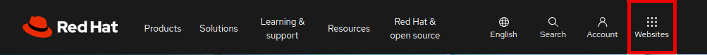
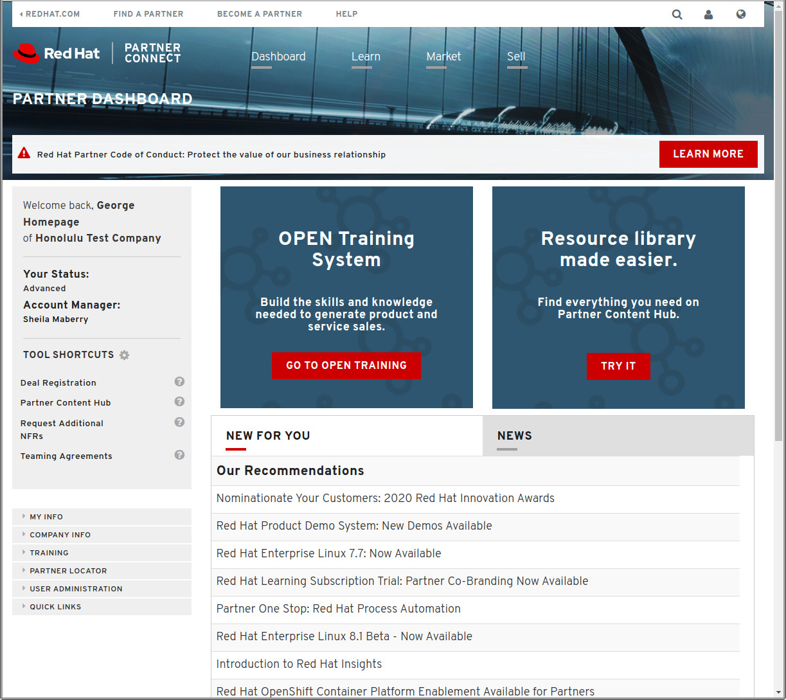

= Red Hat Partner Connect

*Red Hat Partner Connect* is a partner community where we work together to build ideal customer solutions and support the services you provide with our products. 

As a Partner this is where you can become part of our campaigns to cut through the noise of today's marketing environments. We'll help you differentiate your brand as an open source partner and provide training every step of the way.

[.lead] 
To access Partner Connect goto link:https://www.redhat.com/en[https://www.redhat.com/en^] and click on the PARTNERS tab (see image below):

[%hardbreaks]

=== Your first step is to connect your partner login with your organization.  To do this click on the *Business partner login* button:

=== Click on the *JOIN AN EXISTING PARTNER COMPANY* button.  This will take you through a series of web pages whose goal is to *connect* your *Partner Login* to your organization.

The registration process will connect your login id with your company partner information.  The completion of this step will initiate a process where an email is sent to your address.  In the email will be a link that is used to complete the process.  Clicking on the link will finish your connection to the partner portal and will take you to the Partner Dashboard.  The dashboard should look like the following:

Let's start by looking at the important stuff.

Notice the menu links in the bottom left corner.  Notice how they can be expanded to view various information links.

Click on the *Training -> Company Accreditations* menu path.  This page can be used to display all users who have passed the Accreditation tests.

Experiment with this and other menu paths that are available to you.

