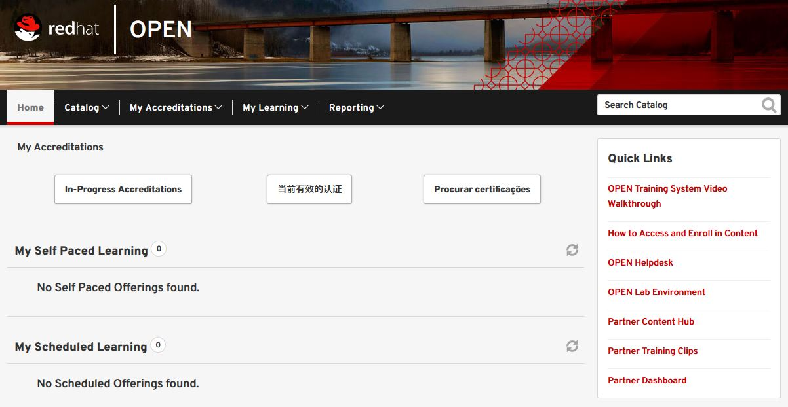

= Red Hat Partner Training - OPEN

*Red Hat Partner Training - OPEN* offers free, role-specific training for partners across Red Hat's entire portfolio.

[.lead] 
To access Partner Partner Training goto link:https://www.redhat.com/en[https://www.redhat.com/en^] and click on the PARTNERS tab (see image below):

image::images/partner_connect.jpg[Partner Connect]

[%hardbreaks]

[.lead]
Next click on the *GROW WITH US* button.  This will take you to the page where you can access the trianing material.

image::images/grow_with_us2.jpg[]

[.lead]
Click on the *VISIT RED HAT OPEN* button.  This will take you to a site where you can see of list of training options.  If interested, click around on the various information found on this page.  When you are ready to get trained, click the *GET TRAINED* button to be taken to the training website.

On this page notice that you can see information pertaining to the following topics:

* *Catalog* - use this to see a catalog of online training classes available
* *My Accreditations* - displays a list of accreditations you have achieved
* *My Learning* - displays a list of learning paths that you have completed
* *Reporting* - displays a list of reports that are available

You can use the *Catalog* menu to research available online training for various Red Hat technologies.

