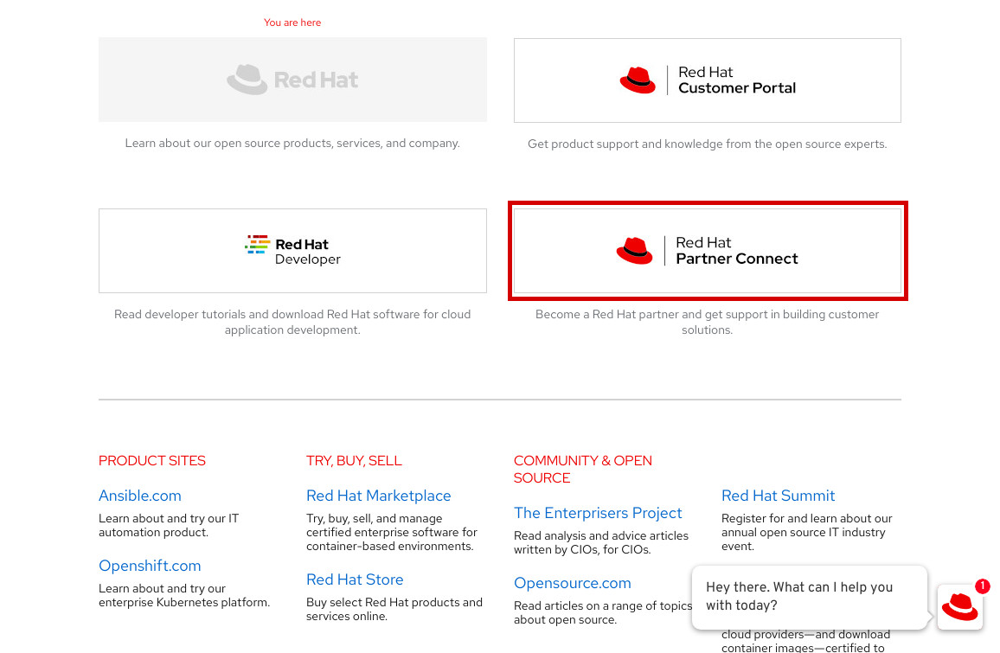
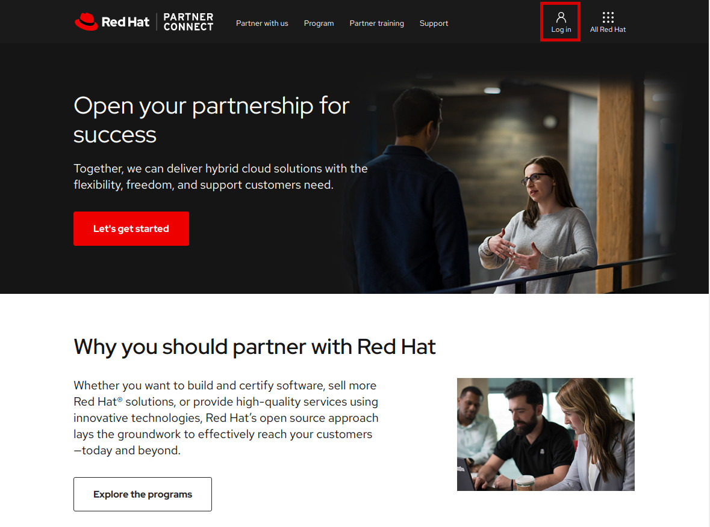
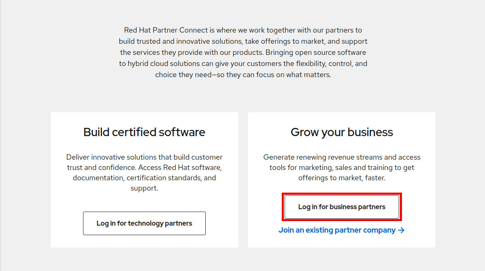
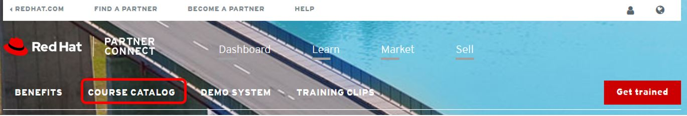
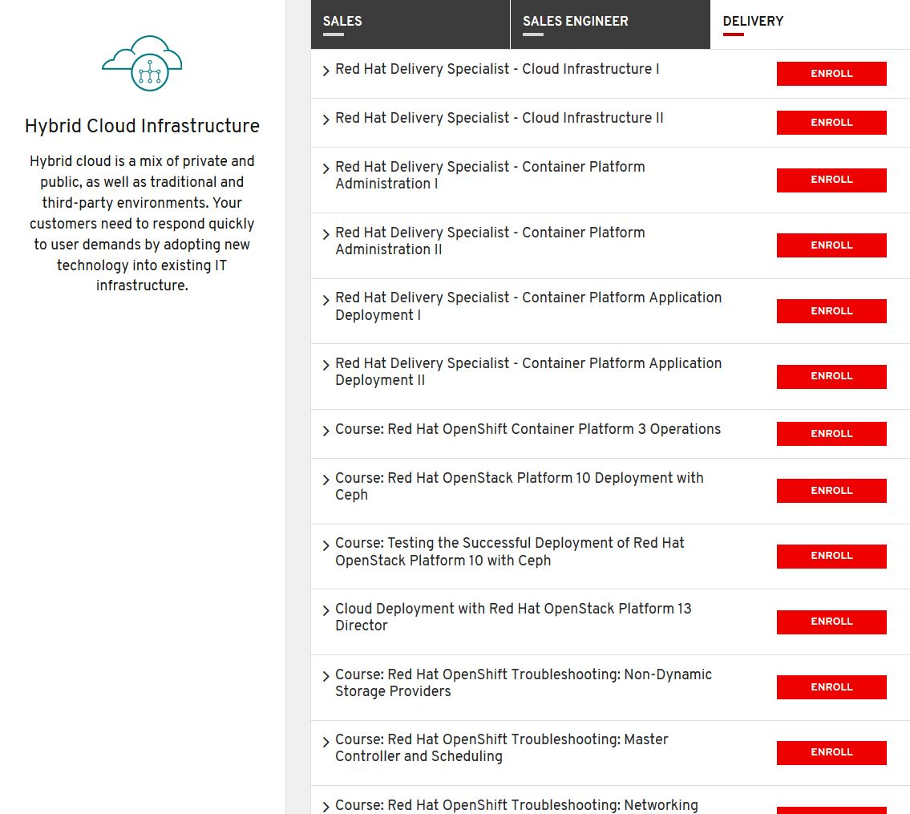

= Red Hat Partner Training - OPEN

*Red Hat Partner Training - OPEN* offers free, role-specific training for partners across Red Hat's entire portfolio.

[.lead]
To access Partner Partner Training goto link:https://www.redhat.com/en[https://www.redhat.com/en^] and click on the "Websites" link (see image below).

[%hardbreaks]

[.lead]
Next click on the *PARTNER CONNECT* button.

[.lead]
Next click on *Log in* button.

[.lead]
Click on *Log in for business partners*.

[.lead]
After successful login, click on the *Learn* tab and then click on *OPEN Course Catalog*

[.lead]
The resulting page will contain a catalog of all the OPEN training that is available for *Sales*, *Sales Engineer* and *Delivery*.  For example, if you'd like to see all *Delivery* training available for *Hybrid Cloud Infrastructure*, on the left under *Categories -- IT Challenge*, click on *Hybrid Cloud Infrastructure* and then in the filter box, type in *Delivery*.

